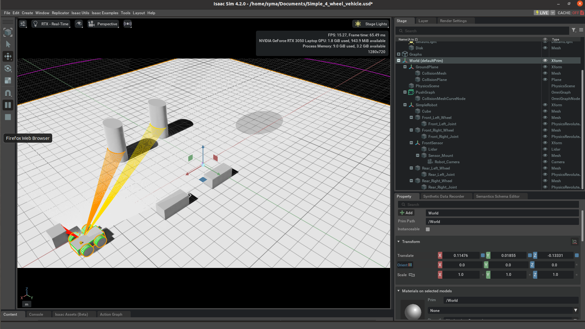

This repository contains a **robot simulation** built using **NVIDIA Isaac Sim**. The simulation includes:
- A **custom robot** with revolute joints for wheel movement.
- **WASD keyboard controls** for movement and turning.
- A **rotating 2D LiDAR** for mapping.
- A **front-facing camera** for visual processing.



**How to run this repository**
Make sure **Isaac Sim** is installed. If you haven’t installed it yet:
- Install **Omniverse** from: [https://developer.nvidia.com/nvidia-omniverse-platform](https://developer.nvidia.com/nvidia-omniverse-platform).
- Install **Isaac Sim** from **Omniverse Launcher**.

Open a terminal and run:
```bash
git clone https://github.com/syma-afsha/Four_wheel_robot_isaacsim.git
cd Four_wheel_robot_isaacsim

Running the Simulation in Isaac Sim:
1. Open a terminal and run:
  ./isaac-sim.sh
or open Isaac Sim from Omniverse Launcher.

2. Open the Robot Scene:
- Click File > Open.
- Select my_robot.usd and click Open.

3. Enable Physics:
- Check if a Physics Scene exists in the Stage Tree.
- If not, add one:
    Right-click Stage  ▶  Create > Physics  ▶ Physics Scene.
- Make sure Gravity is enabled.

4. Press Play
- Click ▶ Play to start the simulation.


